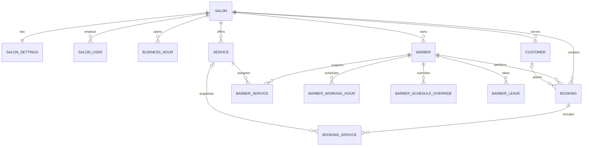

# BarberFlow database architecture

This document defines the first persistent data model for the BarberFlow SaaS backend. The existing Angular booking/admin experience remains the product specification; the API and SQL Server model are being introduced behind it.

## Design goals

- **Multi-salon from day one.** Tenant-owned records carry a `SalonId` boundary.
- **Server-side booking truth.** Availability, overlaps, working hours and booking mutations will move from browser storage to the API.
- **Preserve booking history.** Booking rows store customer snapshots and `BookingServices` store service name/duration/price snapshots so later profile edits do not rewrite history.
- **Support current flows.** Online booking, admin booking, walk-ins, group bookings, home services, leaves and same-day availability are represented.
- **Avoid premature auth coupling.** `SalonUsers` exists now, while authentication/authorization will be wired in a later phase.

## Core tables

| Table | Purpose |
| --- | --- |
| `Salons` | SaaS tenant / salon account |
| `SalonSettings` | Booking interval, same-day rules, cancellation rules and related settings |
| `SalonUsers` | Owner/manager/receptionist/barber accounts for future authentication |
| `BusinessHours` | Salon-level weekly opening hours |
| `Barbers` | Barber profiles scoped to a salon |
| `BarberServices` | Many-to-many mapping between barbers and services |
| `BarberWorkingHours` | Barber-specific weekly schedule |
| `BarberScheduleOverrides` | One-day availability/unavailability overrides |
| `BarberLeaves` | Date-range leave records |
| `Services` | Service catalog, duration and prices |
| `Customers` | Customer profile/history anchor; phone is intentionally nullable for walk-ins |
| `Bookings` | Appointment header, customer snapshot, assigned barber, timing, status and totals |
| `BookingServices` | One or more service snapshots attached to a booking |

## Relationship overview



## Multi-tenant boundary

The main tenant key is `SalonId`. The API must never accept a salon identifier from an untrusted client and use it blindly. Once authentication is added, the authenticated user's salon will become the source of the tenant context and all queries/mutations will be scoped server-side.

## Booking conflict rule

A barber booking conflicts when appointment windows overlap:

```text
existingStart < requestedEnd
AND
requestedStart < existingEnd
```

Cancelled bookings do not block availability. This rule will be enforced in the booking application service/API transaction, not only in Angular.

## Walk-in behavior

The current approved walk-in behavior maps naturally to this model:

1. Select a service.
2. Determine eligible barbers through `BarberServices`.
3. Apply salon hours, barber working hours, day overrides and leave.
4. Check existing non-cancelled bookings.
5. Prefer a barber available immediately.
6. Otherwise offer the next available eligible barber later today and persist the actual start time.
7. Create/update a `Customer` when appropriate, but allow phone-less walk-in customers.

## Current frontend-to-database mapping

| Angular/local state | Database target |
| --- | --- |
| Admin services | `Services` |
| Admin barbers | `Barbers`, `BarberServices`, scheduling tables |
| Admin settings | `SalonSettings`, `BusinessHours` |
| Customer directory | `Customers` |
| Online/admin/walk-in bookings | `Bookings`, `BookingServices` |
| Barber leave / availability | `BarberLeaves`, `BarberScheduleOverrides` |

## Next backend step

After this foundation is merged, the first production API module should be **Bookings**:

- query availability;
- create online booking;
- create walk-in booking;
- validate overlap transactionally;
- reschedule/reassign;
- cancel and update status.

The Angular application should then replace localStorage booking persistence with this API while preserving the approved UI behavior.
